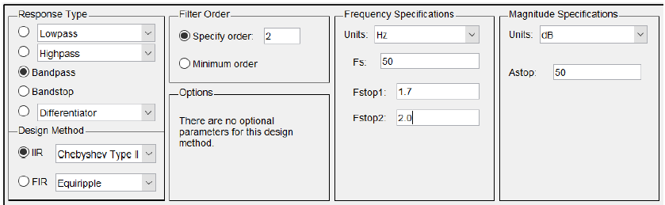
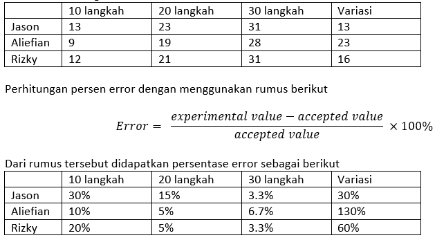

# Step-Counting

## Laporan Tugas Akhir Perancangan Sistem Digital
Nama Anggota :
- Jason Adrian Mahalim
- Muhamad Aliefian R.
- Muhamad Rizky Febrianto

## Pendahuluan
Pedometer merupakan sebuah alat untuk mengukur langkah ketika dipakai oleh pengguna. Terdapat 2 macam pedometer, yaitu pedometer mekanikal dan elektronik. Pedometer mekanikal menggunakan mekanisme seperti jam pendulum, ketika pengguna bergerak, maka pendulum akan mengayun satu kali dan dari ayunan tersebut langkah akan terhitung satu. Beberapa pedometer elektronik menggunakan pendulum untuk menghitung langkah, namun ada juga pedometer elektronik yang menggunakan accelerometer untuk menghitung langkah. Cara pedometer elektronik dengan accelerometer bekerja adalah dengan menerima sinyal dari langkah pengguna, mengolah sinyal tersebut sehingga tidak memiliki banyak noise, dan akhirnya ada proses kalkulasi langkah yang dilakukan oleh komputer pada pedometer tersebut. Pada tugas akhir kali ini, kami membuat coding matlab dan filter yang nantinya bisa digunakan untuk membuat pedometer. Coding matlab dan filter yang kami buat berguna untuk mereduksi dan menganalisis noise yang terdapat pada data yang kami ambil. 

Requirement
Ada beberapa peralatan yang dibutuhkan untuk membuat Coding pedometer sederhana, peralatan tersebut yaitu:
- Smartphone dengan accelerometer
- Aplikasi sensor untuk menangkap data
- Matlab

## Data
Data diambil menggunakan Smartphone yang memiliki aplikasi sensor. Terdapat 12 data yang diambil untuk mengetes tingkat akurat pedometer. Data yang diambil oleh kami adalah 10 langkah, 20 langkah, 30 langkah, dan variasi. Untuk variasi sendiri Jason mengambil 10 langkah berlari, Rizky mengambil 5 langkah berjalan & 5 berlari, dan Aliefian… . 

## Filter

Kami menggunakan magnitude untuk mengkitung vektor dari sumbu x, y dan z. Kemudian, magnitude di detrend untuk merapikan data sehingga mudah untuk di fft. Hasil dari fft detrend tersebut nantinya akan digunakan untuk membuat filter. Terakhir, data kemudian di filter dengan menggunakan fungsi filtfilt dan parameter yang digunakan berasal dari design filter yang telah dibuat di atas.

Filter yang kami design merupakan filter bandpass yang artinya kami memfilter signal yang ada di kiri dan kanan frekuensi cutoff. Tipe filter yang kami gunakan adalah IIR Chebyshev type 2. Kemudian filter order yang kami gunakan adalah 2, dan frekuensi cutoff yang kami input 1,7 dan 2,1. Dan magnitude spesification yang digunakan adalah 50 dB.

## Analisis Data

Data yang kami dapatkan dan hasil yang kami peroleh dari perhitungan menggunakan source code matlab kami adalah sebagai berikut

Terdapat beberapa faktor yang menyebabkan error, seperti:
- Frekuensi cutoff yang kurang tepat untuk setiap data, karena kami hanya menggunakan 1 filter saja
- Design filter yang belum sempurna
- Perbedaan dari pola langkah dan tempo jalan setiap orang

## Kesimpulan

Pedometer yang kami buat masih memiliki tingkat error yang cukup besar, hal-hal tersebut karena frekuensi cutoff yang kurang tepat untuk setiap data, design filter yang belum sempurna, dan perbedaan dari pola langkah dan tempo jalan setiap orang

## Referensi
- Helmenstine, T. (2014, May 16). Calculate Percent Error. Retrieved from Science Notes: https://sciencenotes.org/calculate-percent-error/
- Woodford, C. (2018, September 2018). Pedometers. Retrieved from expainthatstuff!: https://www.explainthatstuff.com/how-pedometers-work.html
 
